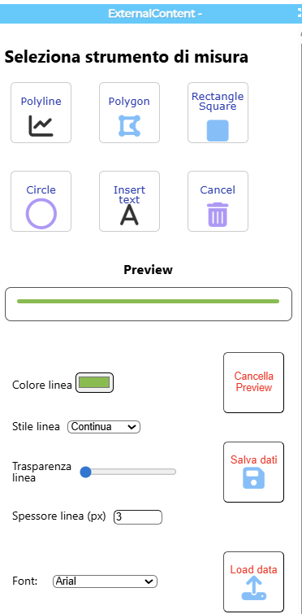
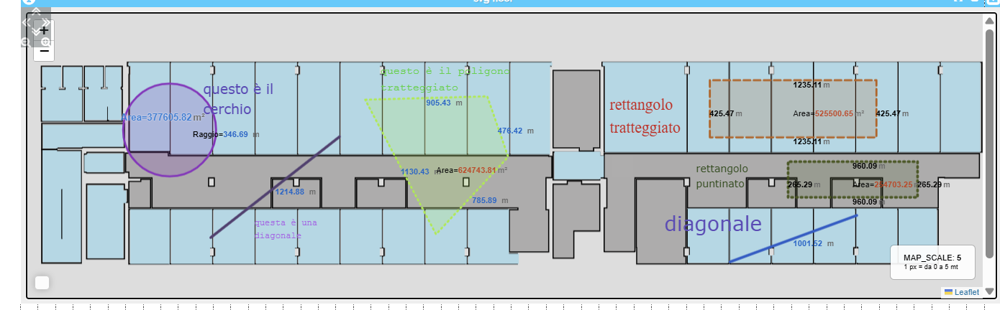

# Snap4City Toolbox + SVG Map

## Project Description
This project implements an **interactive drawing system** integrated into the **Snap4City platform**, composed of:
- A **Toolbox** (external content HTML/JS) that allows the user to select drawing tools (line, polyline, polygon, rectangle, circle, free text) and style parameters (color, thickness, transparency, font, etc.);
- An **SVG Map** loaded as external content that receives commands from the Toolbox through **Client-Side Business Logic (CSBL)** and enables drawing shapes, computing measurements (lengths, perimeters, areas), and adding text annotations.

The communication between Toolbox and Map is managed via the **entry point `action(param)`**, which receives JSON data generated by the Toolbox and interprets it to build the corresponding graphical layers.

---

## Main Features
- Interactive drawing of polylines, polygons, rectangles, circles, and textboxes.
- Automatic calculation of:
    - Lengths and segments
    - Perimeters
    - Areas (also for irregular polygons)
- Customization of line styles:
    - Solid, dashed, or dotted
    - Color and transparency
- Insertion and positioning of **editable textboxes** on the map.
- **Saving and loading** drawings in JSON format, including textbox dimensions and positions.

---

## Repository Structure
The repository contains two main source files:
- `toolbox_definitivo.html` → source code of the Toolbox (UI and event triggers).
- `mappa_svg_definitiva.html` → source code of the SVG Map (drawing functions, measurements, save/load logic).

---

## Example Data Flow
1. The user selects a tool and parameters from the **Toolbox**.
2. The Toolbox sends a JSON message to the Map using a **CSBL trigger**.
3. The Map processes the JSON inside the function `action(param)` and renders the shape.
4. Measurements are displayed as **tooltips or labels** next to the objects.
5. Drawings and textboxes can be **saved** to JSON and **reloaded** later.

---

## Requirements
- **Snap4City platform** with **External Content** widgets.
- Included libraries:
    - [Leaflet](https://leafletjs.com/)
    - [Leaflet.draw](https://github.com/Leaflet/Leaflet.draw)
    - [jQuery](https://jquery.com/)

---

## Results and Future Improvements
This project demonstrates how Snap4City can be extended with custom tools for:
- Measurements and graphical annotations on SVG maps
- Integration with CSBL-based communication between widgets

**Future improvements include:**
- Optimizing label positioning for area and side values to avoid overlaps
- Improving textbox placement when loading from JSON
- Automatic adaptation of the `MAP_SCALE` parameter to different map sources

---

## Screenshots
You can add screenshots or animated GIFs to better illustrate the Toolbox and Map interface.  
Save your images in a dedicated folder (for example `img/`) inside the repository, then reference them in the README using Markdown:

```markdown

